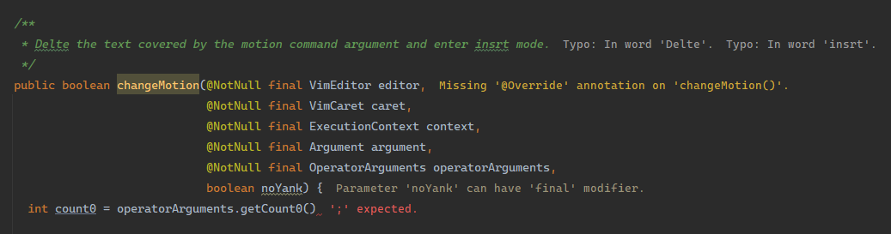

# Inspection Lens 

IntelliJ plugin that shows errors, warnings, and other inspection highlights inline.

After installing the plugin, inspection descriptions will appear after the ends of lines, and the lines will be highlighted with a background color. Shown inspection severities are **Errors**, **Warnings**, **Weak Warnings**, **Server Problems**, **Grammar Errors**, **Typos**, and other inspections from plugins or future IntelliJ versions that have a high enough severity level. Each severity has a different color, with support for both light and dark themes.

Note: The plugin is not customizable outside the ability to disable/enable the plugin without restarting the IDE. If the defaults don't work for you, I recommend trying the [Inline Error](https://plugins.jetbrains.com/plugin/17302-inlineerror) plugin which can be customized, building your own version of Inspection Lens, or proposing your change in the [issue tracker](https://github.com/chylex/IntelliJ-Inspection-Lens/issues).

Inspired by [Error Lens](https://marketplace.visualstudio.com/items?itemName=usernamehw.errorlens) for Visual Studio Code, and [Inline Error](https://plugins.jetbrains.com/plugin/17302-inlineerror) for IntelliJ Platform.

